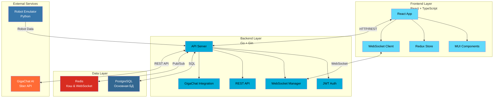

# 🏭 Умный Склад (Smart Warehouse)

## 📖 О проекте

Умный Склад — это комплексное веб-решение для автоматизации складских операций. Система объединяет мониторинг автономных роботов в реальном времени, AI-прогнозирование остатков и аналитику исторических данных в едином интерфейсе.

## 🏗 Архитектура системы


## 🚀 Быстрый старт
### 1. Клонирование и настройка
```bash
git clone https://github.com/Senpa1k/Smart_Warehouse.git
cd Smart_Warehouse
cp .env_example .env
```
## 2. Запуск приложения
```bash
docker-compose up --build -d
```
## 3. Открытие в браузере
Адрес: http://localhost

Тестовые учетные данные:

```text
Email: admin@warehouse.com
Password: admin123
```

## 🛠 Технологический стек
### Backend (Go)
* **Go 1.24 + Gin** - высокопроизводительный API сервер

* **GORM** - работа с PostgreSQL

* **JWT** - аутентификация

* **Redis** - кэш и WebSocket

* **GigaChat API** - AI-прогнозирование

### Frontend (TypeScript)
* **React 18 + TypeScript** - пользовательский интерфейс

* **Vite** - сборка и разработка

* **Material-UI** - компоненты дизайна

* **Redux Toolkit** - управление состоянием

* **WebSocket** - real-time обновления

### Инфраструктура
* **PostgreSQL** - основная БД

* **Docker Compose** - контейнеризация

* **Nginx** - веб-сервер

* **Python** - эмулятор роботов

## 📁 Ключевые компоненты
### Backend структура
```text
backend/
├── cmd/app/                 # Точка входа приложения
├── internal/
│   ├── delivery/http/       # HTTP хендлеры (REST API)
│   ├── service/             # Бизнес-логика
│   ├── repository/          # Доступ к данным (PostgreSQL)
│   └── config/              # Конфигурация
├── migrations/              # Миграции БД
└── go.mod                  # Зависимости
```
### Frontend структура
```text
frontend/
├── src/
│   ├── pages/              # Страницы приложения
│   │   ├── LoginPage.tsx   # Авторизация
│   │   ├── DashboardPage.tsx # Мониторинг
│   │   └── HistoryPage.tsx # История
│   ├── components/         # UI компоненты
│   ├── store/              # Redux store
│   └── services/           # API клиенты
└── package.json           # Зависимости
```
## 🎯 Основные функции
### 🔐 Авторизация
* JWT аутентификация

* Валидация email/пароля

* Разграничение прав доступа

### 📊 Дашборд реального времени
* Интерактивная карта склада с роботами

* Статистика активных роботов и проверок

* Таблица последних сканирований

* WebSocket обновления

### 🤖 AI-аналитика
* Интеграция с GigaChat API

* Прогноз остатков на 7 дней

* Рекомендации по пополнению запасов

### 📈 Исторические данные
* Фильтрация по периоду, зонам, статусам

* Сортировка и пагинация

* Экспорт в Excel/PDF

* Визуализация трендов

### 📁 Загрузка данных
* Drag & Drop CSV импорт

* Валидация формата файлов

* Предпросмотр данных

## 🔌 API Endpoints

### Основные эндпоинты

| Метод | Путь | Назначение |
|-------|------|------------|
| `POST` | `/api/auth/login` | Авторизация пользователя |
| `POST` | `/api/robots/data` | Прием данных от роботов |
| `GET` | `/api/dashboard/current` | Текущее состояние склада |
| `GET` | `/api/inventory/history` | Исторические данные |
| `POST` | `/api/inventory/import` | Загрузка CSV файлов |
| `POST` | `/api/ai/predict` | Получение AI-прогнозов |

### WebSocket события

| Событие | Назначение |
|---------|------------|
| `robot_update` | Обновление позиций и статусов роботов |
| `new_scan` | Новые сканирования товаров |
| `inventory_alert` | Предупреждения о критических остатках |

## 🤖 Эмулятор роботов
Автономный эмулятор на Python для тестирования системы:

* **5 виртуальных роботов** с уникальными ID

* **Реалистичное перемещение** по зонам склада (A-E)

* **Сканирование товаров** с разными статусами

* **Симуляция батареи** (расход и зарядка)

* **Настраиваемый интервал** обновления (10 сек)

## 🐳 Управление контейнерами
### Основные команды
```bash
# Запуск всех сервисов
docker-compose up -d

# Просмотр логов
docker-compose logs -f backend
docker-compose logs -f frontend

# Остановка
docker-compose down

# Пересборка
docker-compose up --build -d
```
### Доступные сервисы
* **Frontend:** http://localhost (порт 80)

* **Backend API:** http://localhost:3000

* **PostgreSQL:** localhost:5432

* **Redis:** localhost:6379

## 🔧 Разработка
### Локальный запуск Backend
```bash
cd backend
go mod download
go run cmd/app/main.go
```
### Локальный запуск Frontend
```bash
cd frontend
npm install
npm run dev  # http://localhost:3001
```
## 📞 Поддержка
При возникновении проблем:

1. **Проверьте Docker** - убедитесь, что Docker запущен
   
2. **Проверьте порты** - порты 80, 3000, 5432 должны быть свободны
   
3. **Проверьте .env файл** - должен быть создан в корне проекта
   
4. **Просмотрите логи** - docker-compose logs для диагностики

## 

*Разработано для автоматизации складской логистики будущего 🚀*
